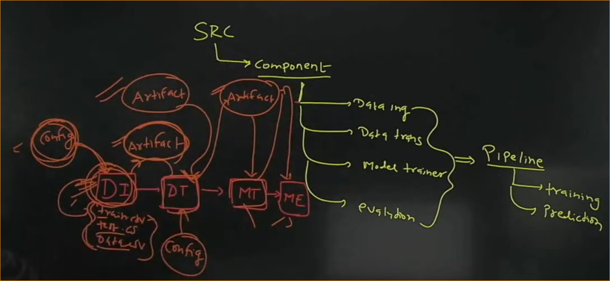
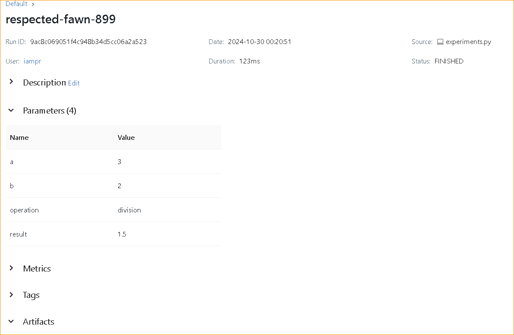
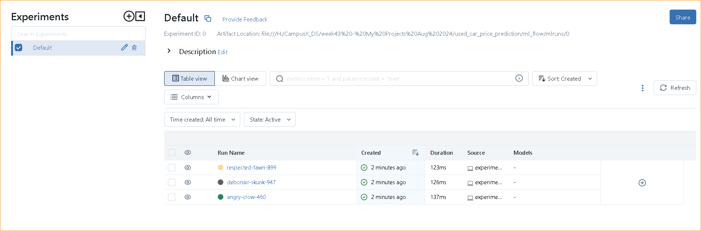

# Used Card Price Prediction Workflow

**Complete Project Flow**

- Clone from Common folder structure
- Write setup.py code
- Run init_setup.sh file
- Activate venv
- Download Experiment Data: https://www.kaggle.com/competitions/playground-series-s3e8/data
- Perform Cleaning, EDA, Feature Engineering in jupyterfile
- Perform pre-processing & transformation pipeline (check sample experiments.ipynb file)
- Build model on that transformed data
- Once all the experiments are completed, we know what type of preprocessing is required for best results so we write modular codes for that inside src folder
- Use exception & logger for exception handling & logging the flow to debug

- There are 2 pipelines of any ML Project:
   1. Training pipeline: data ingestion, data transformation, model trainer, model evaluation
   2. Prediction pipeline: data ingestion, prediction: single or bulk

- Now, Write similar code strucutre for src components like data ingestion, data transformation, model evaluation, model trainer
- Write common codes inside src.utils
- ML Project Template - <template_ml_project.zip>

- **SRC - data_ingestion.py**
- write code to read data from source, save raw data file, perform train test split, save train test data files & return train & test data path
- create object of the class & test if its working

if __name__ == "__main__":
    obj = DataIngestion()
    obj.initiate_data_ingestion()

- check pip list if your project is showing as package

- **SRC - data_transformation.py**
- write code to save output file, write code for data preprocessing & then apply transformation, concat input & target variable for both train & test and return train_arr & test_arr to be used in model trainer component

- **SRC - model_trainer.py**
- write code to save model output file, perform training & select best model

- **SRC - pipeline - training_pipeline.py**
- write code to perform each component step by step ingestion, transformation, model_trainer
- prediction_pipeline train multiple models and select the best model based on r2 score

- **SRC - pipeline - prediction_pipeline.py**

- workflow of prediction pipeline
- get data
   1. bulk data
   2. single row data
   3. get data from web_app

- preprocess data for preprocessing & transformation
- pass transformed data to model
- evaluate the predictions

- load preprocessor.pkl & model.pkl files using load_object function written inside utils.py file
- transform the data using preprocessor
- pass the transformed data to model for prediction and return the predicion

- **To check predictions we can either test it on postman or create a flask app**

- **ML Flow Integration**
- mlflow==2.2.2
- https://mlflow.org/docs/latest/getting-started/intro-quickstart/index.html
- we use mlflow for experiments tracking we are performing inside pipelines training & prediction pipelines
- model management - handling different versions of models - model registry (we can also use dagshub or github)
- reproducability

- to track this experiment using mlflow we need to start the mlflow server
- and log params & metrics
- it will create mlruns inside which we will find each run logs about what value we provided as input for a, b & ops & what was the result
- thats experiment tracking
- instead of checking these experiments inside folders we can check it on UI also: "mlflow ui"

 

## Stages of the MLOps Project

1. **Build: Model Development**
   - **Tools**: Git, GitHub, Python
   - **Activities**: Develop the machine learning model, use Git for version control, and push the code to GitHub.

2. **Test: Unit & Integration Testing**
   - **Tools**: Pytest, Tox
   - **Activities**: Write unit tests and integration tests to ensure code quality, using Tox for automation across different environments.

3. **Deliver: Docker Image Creation**
   - **Tools**: Docker, GitHub Actions
   - **Activities**: Create a Dockerfile, automate the image build process with GitHub Actions, and store the image in an Azure Container Registry.

4. **Deploy: CI/CD on Azure**
   - **Tools**: Azure DevOps
   - **Activities**: Set up CI/CD pipelines to automate deployment to Azure services.

5. **Monitoring: Post-Deployment Monitoring**
   - **Tools**: Evidently AI, Apache Airflow
   - **Activities**: Monitor model performance with Evidently AI and use Airflow for scheduling and managing workflows.

6. **Re-training: Continuous Improvement**
   - **Activities**: Set up retraining processes to update the model with new data and automate this in your pipeline.

## Additional Components

7. **Data Management: DVC (Data Version Control)**
   - **Purpose**: DVC helps you manage your datasets and model files by tracking changes and versions. It integrates seamlessly with Git, allowing you to version control data alongside your code.

8. **Experiment Tracking: MLflow**
   - **Purpose**: MLflow is used to track experiments, including parameters, metrics, and artifacts. It provides a central repository for all your model training experiments, enabling better reproducibility and collaboration.

9. **Model Registry: DagsHub**
   - **Purpose**: DagsHub acts as a model registry where you can store and manage different versions of your trained models. It allows you to keep track of model lineage and serves as a single source of truth for your models.

10. **BentoML**
    - **Purpose**: BentoML is a framework for packaging and serving machine learning models as APIs. It simplifies the process of deploying models to production by providing tools for building REST APIs around your models, making it easy to serve them in a production environment.

## Getting Started
To get started with this project, clone the repository and follow the setup instructions in the respective sections.